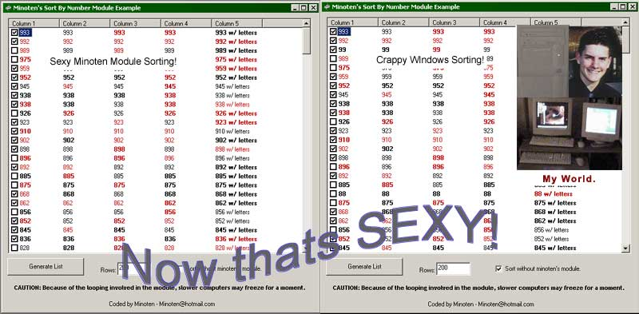



## Sort Listview Columns Numerically

### Description

Tired of windows "numerical" listview sorting?

1

11

2

222

Well now you can sort your listview using true numerics!

1

2

11

222

An easy to use module, just one function to call on!

Enjoy ;-) Feedback is appreciated!
 
### More Info
 
This module may be slow on a 486 :-D

A numerically sorted listview, descending or ascending.

It requres you to enter 2 listviews, as opposed to one.

             |
---                |---
**Submitted On**   |2002-03-20 22:44:42
**By**             |[Keith SImons](https://github.com/Planet-Source-Code/PSCIndex/blob/master/ByAuthor/keith-simons.md)
**Level**          |Advanced
**User Rating**    |4.5 (18 globes from 4 users)
**Compatibility**  |VB 5\.0, VB 6\.0
**Category**       |[Custom Controls/ Forms/  Menus](https://github.com/Planet-Source-Code/PSCIndex/blob/master/ByCategory/custom-controls-forms-menus__1-4.md)
**World**          |[Visual Basic](https://github.com/Planet-Source-Code/PSCIndex/blob/master/ByWorld/visual-basic.md)
**Archive File**   |[Sort\_Listv640033212002\.zip](https://github.com/Planet-Source-Code/keith-simons-sort-listview-columns-numerically__1-32913/archive/master.zip)

